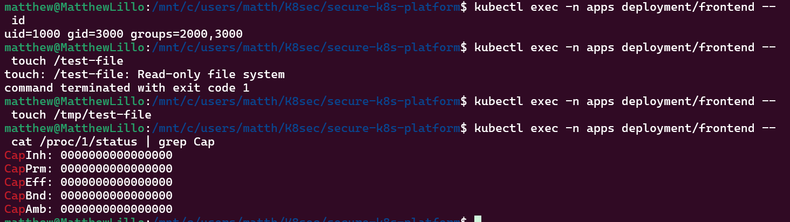
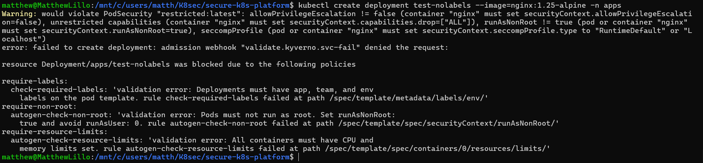
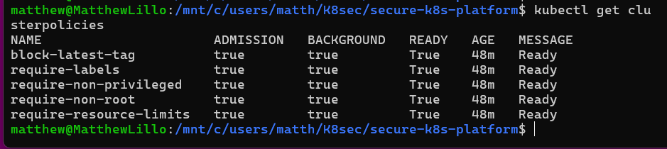
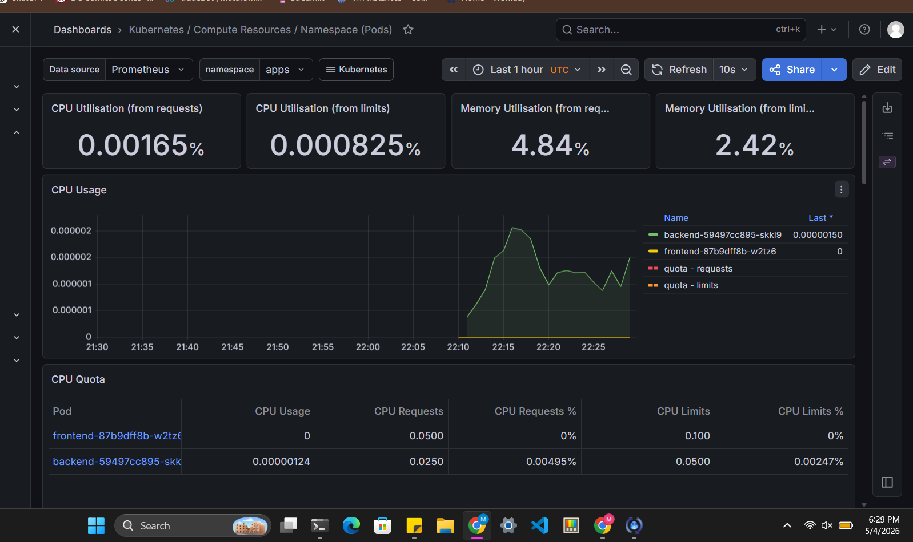
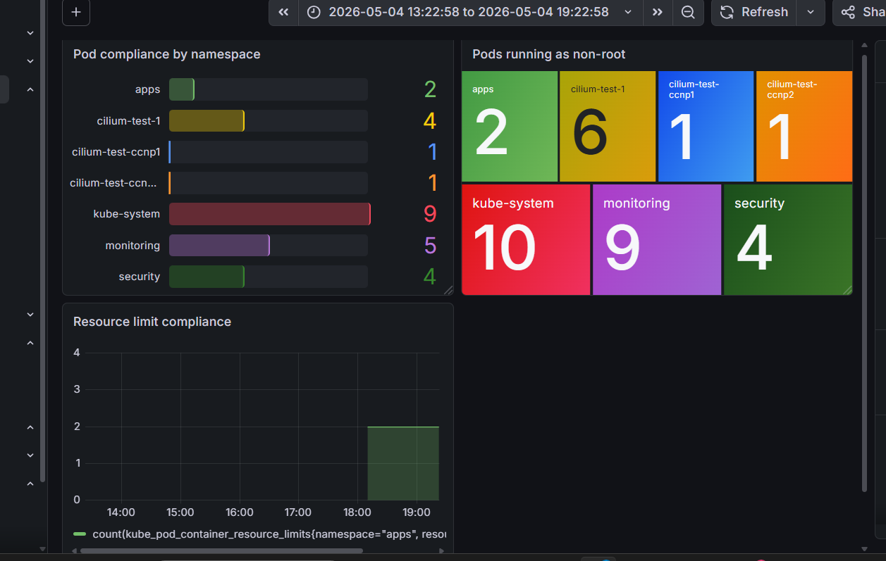
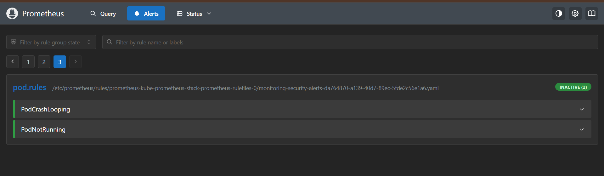

# Secure Kubernetes Platform

A production-grade, multi-layer Kubernetes security platform built on AWS EKS demonstrating defense-in-depth across the full container workload lifecycle — from infrastructure provisioning to runtime threat detection.

## Architecture

The platform enforces security at five distinct layers, each backing up the last. If a control at one layer fails or is bypassed, the next layer catches it.

```
┌─────────────────────────────────────────────────────────────┐
│                     CI/CD Pipeline                          │
│         Checkov · Trivy · Gitleaks · kubesec                │
└───────────────────────┬─────────────────────────────────────┘
                        │
┌───────────────────────▼─────────────────────────────────────┐
│                  AWS EKS Cluster                            │
│                                                             │
│  ┌─────────────┐  ┌──────────────┐  ┌───────────────────┐  │
│  │  Namespace  │  │     RBAC     │  │  Pod Security     │  │
│  │  Isolation  │  │ Least-Priv   │  │  Admission        │  │
│  └─────────────┘  └──────────────┘  └───────────────────┘  │
│                                                             │
│  ┌─────────────────────────────────────────────────────┐    │
│  │              Kyverno Admission Control              │    │
│  │   require-non-root · require-limits · block-latest  │    │
│  └─────────────────────────────────────────────────────┘    │
│                                                             │
│  ┌─────────────────────────────────────────────────────┐    │
│  │           Cilium NetworkPolicy (eBPF)               │    │
│  │        Default-deny · Explicit allow-list           │    │
│  └─────────────────────────────────────────────────────┘    │
│                                                             │
│  ┌──────────────┐         ┌───────────────────────────┐    │
│  │    Falco     │         │   Prometheus + Grafana    │    │
│  │   Runtime    │         │   Security Posture        │    │
│  │  Detection   │         │   Dashboard               │    │
│  └──────────────┘         └───────────────────────────┘    │
└─────────────────────────────────────────────────────────────┘
```

## Security Layers

| Layer | Component | What It Enforces |
|-------|-----------|-----------------|
| Infrastructure | Terraform + KMS | Encrypted secrets at rest, IRSA pod identity, Bottlerocket nodes |
| Identity | RBAC + ServiceAccounts | Least-privilege per-pod AWS and Kubernetes identity |
| Workload | Pod Security Admission | Restricted profile enforced on apps namespace |
| Policy | Kyverno | Non-root, resource limits, approved images, required labels |
| Network | Cilium NetworkPolicy | Default-deny, explicit allow-list, eBPF enforcement |
| Runtime | Falco | Syscall-level detection, MITRE ATT&CK mapped rules |
| Observability | Prometheus + Grafana | Security posture dashboard, policy violation alerting |

## Tech Stack

**Cloud:** AWS EKS, KMS, IAM/IRSA, S3, DynamoDB, CloudTrail, Secrets Manager

**Infrastructure as Code:** Terraform (VPC, EKS, KMS, remote state backend)

**Security:** Kyverno, Falco, Cilium, Pod Security Admission, RBAC

**Observability:** Prometheus, Grafana, Alertmanager


---

## Key Security Design Decisions

**Bottlerocket over Amazon Linux 2** — Immutable OS with a read-only root filesystem and minimal attack surface built specifically for running containers. Significantly smaller CVE exposure than a general-purpose Linux distribution.

**IRSA over node IAM roles** — Each pod gets its own scoped AWS IAM identity via projected ServiceAccount tokens. Compromise of one pod does not yield node-level AWS access. The node IAM role itself has minimal permissions.

**KMS-encrypted etcd secrets** — Kubernetes Secrets are encrypted at rest using a dedicated KMS key with automatic rotation enabled. Without this, Secrets are stored as base64 in etcd — effectively plaintext to anyone with raw etcd access.

**Kyverno over OPA Gatekeeper** — Kyverno uses Kubernetes-native YAML patterns instead of Rego, has better auto-generation of rules for pod controllers (pod-level rules automatically apply to Deployments via autogen), and has stronger adoption momentum in 2025–2026. Evaluated both and chose Kyverno for operational simplicity without sacrificing enforcement capability.

**Default-deny NetworkPolicy** — All traffic blocked by default. Every communication path is explicitly defined and enforced at the kernel level by Cilium's eBPF dataplane. This is the only correct approach — maintaining an allowlist of bad traffic is impossible.

**Admission control over developer discipline** — Kyverno rejects non-compliant deployments at the API server. Security standards are enforced mechanically, not culturally.

---

## Threat Model

| Attack Scenario | Mitigating Control |
|----------------|-------------------|
| Malicious image deployed with root process | Kyverno require-non-root + Pod Security Admission restricted profile |
| Container escape via privileged mode | Kyverno require-non-privileged + all capabilities dropped |
| Lateral movement between pods | Cilium NetworkPolicy default-deny with label-scoped allow rules |
| Credential theft via /etc/shadow read | Falco Sensitive File Read rule (MITRE T1003) |
| Attacker installs tools post-compromise | Falco Package Manager Executed rule (MITRE T1072) + read-only filesystem |
| Supply chain attack via mutable image tag | Kyverno block-latest-tag + digest pinning in production |
| Secrets exposed in manifests or env vars | External Secrets Operator + AWS Secrets Manager (EKS deployment) |
| Resource exhaustion from compromised pod | Resource limits enforced via cgroups at kernel level |

---

## Phase 1 — Terraform Infrastructure

All infrastructure is Terraform-managed. No manual console configuration.

**VPC** — Two private subnets and two public subnets across two availability zones. EKS nodes run in private subnets with no direct internet exposure. Subnets tagged correctly for EKS load balancer provisioning.

**EKS Cluster** — Kubernetes 1.29. Control plane logging enabled for API, audit, authenticator, controller manager, and scheduler logs to CloudWatch. API server endpoint access restricted to authorized IPs only.

**Node Group** — `t3.medium` instances using the `BOTTLEROCKET_x86_64` AMI. Bottlerocket's immutable OS significantly reduces the attack surface compared to Amazon Linux 2.

**KMS Encryption** — Dedicated KMS key with automatic rotation encrypts all Kubernetes Secrets at rest in etcd.

**IRSA** — OIDC provider enabled on the cluster. Each ServiceAccount is annotated with a specific IAM role ARN. Pods receive temporary credentials scoped to their role via projected tokens — no shared node credentials.

**Remote State** — S3 bucket with versioning, AES256 encryption, and public access blocked. DynamoDB table for state locking prevents concurrent apply corruption.

---

## Phase 2 — Namespace and RBAC Architecture

### Namespace Design

| Namespace | Pod Security Mode | Purpose |
|-----------|------------------|---------|
| apps | enforce: restricted | Application workloads — strictest security posture |
| monitoring | warn: restricted | Prometheus, Grafana — needs elevated permissions |
| security | warn: restricted | Kyverno, Falco — needs elevated permissions |

`enforce: restricted` on the apps namespace blocks any pod that runs as root, uses privileged mode, mounts host paths, or lacks required security context settings. Violations are rejected before scheduling.

### RBAC

**frontend-sa / backend-sa** — Dedicated ServiceAccount per application. `automountServiceAccountToken: false` prevents injection of API server tokens the pod doesn't need. Annotated with IRSA role ARNs for scoped AWS access.

**pod-reader** — Role in apps namespace allowing Prometheus's ServiceAccount in monitoring to `get`, `list`, `watch` pods for scrape discovery. No write access.

**secret-reader** — Role allowing app ServiceAccounts to `get` Secrets only. No `list` or `watch` — least privilege applies to verbs too.

**falco-clusterrole** — ClusterRole giving Falco read access to nodes, pods, namespaces, services, and workload controllers. Minimum required for metadata enrichment. No write access anywhere.

**viewer** — Read-only ClusterRole for human operators. `get`, `list`, `watch` on all resources. Never bound at the ClusterRole level with write access.

---

## Phase 3 — Pod Hardening

Every container in the apps namespace runs with the following security context, verified with actual output.

```yaml
securityContext:          # Pod level
  runAsNonRoot: true
  runAsUser: 1000
  runAsGroup: 3000
  fsGroup: 2000
  seccompProfile:
    type: RuntimeDefault  # Blocks ~40 dangerous syscalls at kernel level

securityContext:          # Container level
  allowPrivilegeEscalation: false
  readOnlyRootFilesystem: true
  capabilities:
    drop:
      - ALL
```

### Verified Security Controls

```
$ kubectl exec -n apps deployment/frontend -- id
uid=1000 gid=3000 groups=2000,3000
```
Container runs as UID 1000. If a container escape occurs, the attacker arrives on the host as an unprivileged user.

```
$ kubectl exec -n apps deployment/frontend -- touch /test-file
touch: /test-file: Read-only file system
```
Root filesystem is genuinely read-only. An attacker with code execution cannot write files, drop backdoors, or install tools.

```
$ kubectl exec -n apps deployment/frontend -- cat /proc/1/status | grep Cap
CapInh: 0000000000000000
CapPrm: 0000000000000000
CapEff: 0000000000000000
CapBnd: 0000000000000000
CapAmb: 0000000000000000
```
All Linux capabilities dropped. The process has zero kernel-level privileges.

> **Screenshot:** Pod hardening verification output



### nginx Read-Only Filesystem Solution

`readOnlyRootFilesystem: true` breaks nginx because it writes temp files at runtime. Solved by mounting emptyDir volumes at exactly the paths nginx needs — `/tmp`, `/var/cache/nginx`, `/var/run` — while the rest of the filesystem stays read-only. A custom ConfigMap overrides nginx.conf to listen on port 8080 (port 80 requires `NET_BIND_SERVICE` capability which was dropped) and redirect all temp paths to `/tmp`.

---

## Phase 4 — Kyverno Policy Enforcement

Five ClusterPolicies enforcing in the apps namespace with `validationFailureAction: Enforce`.

| Policy | What It Blocks |
|--------|---------------|
| require-non-root | Pods where `runAsNonRoot` is not true |
| require-non-privileged | Containers with `privileged: true` |
| require-resource-limits | Pods missing CPU or memory limits |
| require-labels | Deployments missing `app`, `team`, or `env` labels |
| block-latest-tag | Images using `:latest` or no tag |

Kyverno's autogen feature automatically extends pod-level rules to cover Deployments, DaemonSets, and StatefulSets without writing separate rules.

### Policy Enforcement Verified

```
$ kubectl create deployment test-nolabels --image=nginx:1.25-alpine -n apps

error: failed to create deployment: admission webhook "validate.kyverno.svc-fail" denied the request:

require-labels:
  check-required-labels: Deployments must have app, team, and env labels on the pod template.
require-non-root:
  autogen-check-non-root: Pods must not run as root. Set runAsNonRoot: true.
require-resource-limits:
  autogen-check-resource-limits: All containers must have CPU and memory limits set.
```

Three policies fire simultaneously on a single non-compliant deployment. The admission webhook blocks it before any pod is scheduled.

> **Screenshot:** Kyverno blocking non-compliant deployment



> **Screenshot:** All five Kyverno policies in Ready state



---

## Phase 5 — Cilium NetworkPolicy

Cilium replaced the default Flannel CNI. Flannel creates NetworkPolicy objects but does not enforce them — traffic is not actually blocked. Cilium enforces NetworkPolicy at the eBPF layer, compiling rules into kernel programs that run before packets reach the network stack.

### Policy Architecture

```
Internet ──► frontend:8080          (allow-frontend-ingress)
frontend ──► backend:8080           (allow-frontend-egress-to-backend)
backend  ◄── frontend only          (allow-frontend-to-backend)
*        ──► CoreDNS:53 UDP/TCP     (allow-dns)
monitoring ──► *:8080               (allow-monitoring-scrape)
Everything else ──► BLOCKED         (default-deny-all)
```

The `default-deny-all` policy uses an empty `podSelector: {}` which matches every pod in the namespace. No ingress or egress blocks means nothing is permitted until explicitly allowed.

### Enforcement Verified

```
# Frontend can reach backend — allowed by explicit policy
$ kubectl exec -n apps deployment/frontend -- wget -qO- --timeout=5 http://backend
backend response

# External pod cannot reach backend — blocked by default-deny
$ kubectl exec -n default external-test -- wget -qO- --timeout=5 http://10.43.84.235
wget: download timed out
```

---

## Phase 6 — Falco Runtime Detection

Falco monitors kernel-level syscalls on every container in the cluster and fires alerts when behavior matches known attack patterns. Five custom rules written with MITRE ATT&CK mappings.

> **Note:** Falco's modern eBPF driver requires inotify kernel support that WSL2's custom Microsoft kernel does not expose. Full runtime enforcement is validated on EKS with Bottlerocket nodes. All rules, RBAC, and configuration are committed and ready for EKS deployment.

### Custom Detection Rules

| Rule | Priority | MITRE Technique | What It Detects |
|------|----------|----------------|-----------------|
| Package Manager Executed in Container | WARNING | T1072 — Software Deployment Tools | apt, yum, apk, pip, npm running inside a container at runtime |
| Sensitive File Read in Container | CRITICAL | T1003 — OS Credential Dumping | Reads of /etc/shadow, /etc/passwd by unexpected processes |
| Shell Spawned in Container | CRITICAL | T1059 — Command and Scripting Interpreter | bash, sh, zsh spawned in a running container |
| Write to /etc in Container | ERROR | T1222 — File and Directory Permissions Modification | Any write attempt to /etc — indicates persistence |
| Unexpected Outbound Connection | WARNING | T1048 — Exfiltration Over Alternative Protocol | Backend initiating outbound connections outside cluster CIDR |

MITRE ATT&CK tags map detections to the industry-standard threat framework, enabling direct integration with SOC workflows.

### Falco RBAC

A dedicated `falco-clusterrole` provides read-only access to nodes, pods, namespaces, services, and workload controllers — the minimum required for Kubernetes metadata enrichment in alert output. No write access to any resource.

---

## Phase 7 — Prometheus and Grafana Observability

Deployed via `kube-prometheus-stack` Helm chart — the production-standard deployment including Prometheus, Grafana, Alertmanager, and kube-state-metrics.

`serviceMonitorSelectorNilUsesHelmValues=false` enables Prometheus to discover ServiceMonitors across all namespaces, not just those created by the same Helm release.

### Custom Security Alert Rules

Three PrometheusRules in addition to the 35 shipped by kube-prometheus-stack:

```yaml
KyvernoPolicyViolation  — fires when policy violation counter > 0 for 5 minutes
PodCrashLooping         — fires when any apps namespace pod has non-zero restart rate
PodNotRunning           — fires when any apps namespace pod is not Running for 5 minutes
```

All three rules show INACTIVE (green) in the Prometheus alerts UI — no violations currently active, which is the expected healthy state.

### Custom Security Posture Dashboard

Built in Grafana using PromQL queries:

- **Pod compliance by namespace** — bar chart showing pod count per namespace
- **Pods running as non-root** — tile map showing non-root pod count per namespace
- **Resource limit compliance** — time series showing containers with memory limits set in apps namespace

> **Screenshot:** Grafana showing frontend and backend pod CPU and memory metrics



> **Screenshot:** Custom security posture dashboard



> **Screenshot:** Prometheus showing custom security alert rules active



---

## Repository Structure

```
secure-k8s-platform/
├── terraform/
│   └── eks/
│       ├── main.tf          # VPC, EKS, KMS, remote state, IRSA
│       └── outputs.tf       # Cluster endpoint, CA data, OIDC ARN
├── kubernetes/
│   ├── namespaces/          # apps, monitoring, security with PSA labels
│   ├── rbac/                # ServiceAccounts, Roles, ClusterRoles, bindings
│   ├── apps/                # Frontend and backend deployments, services, ConfigMap
│   ├── kyverno/
│   │   └── policies/        # Five enforcing ClusterPolicies
│   ├── network-policies/    # Default-deny + explicit allow-list
│   ├── falco/               # Custom rules ConfigMap, Helm values
│   └── monitoring/          # PrometheusRule with security alerts
```

---

## Local Development Setup

```bash
# Install k3s without Flannel
curl -sfL https://get.k3s.io | INSTALL_K3S_EXEC="--flannel-backend=none \
  --disable-network-policy --cluster-cidr=10.42.0.0/16" sh -

# Copy kubeconfig
sudo cp /etc/rancher/k3s/k3s.yaml ~/.kube/config
sudo chown $USER:$USER ~/.kube/config

# Install Cilium CNI
cilium install --version 1.15.3
cilium status --wait

# Apply manifests in order
kubectl apply -f kubernetes/namespaces/
kubectl apply -f kubernetes/rbac/
kubectl apply -f kubernetes/apps/frontend-config.yaml
kubectl apply -f kubernetes/apps/

# Install Kyverno
helm repo add kyverno https://kyverno.github.io/kyverno/
helm install kyverno kyverno/kyverno --namespace security --version 3.2.7
kubectl apply -f kubernetes/kyverno/policies/

# Apply NetworkPolicies
kubectl apply -f kubernetes/network-policies/

# Install monitoring stack
helm repo add prometheus-community https://prometheus-community.github.io/helm-charts
helm install kube-prometheus-stack prometheus-community/kube-prometheus-stack \
  --namespace monitoring \
  --set grafana.adminPassword=admin \
  --set prometheus.prometheusSpec.serviceMonitorSelectorNilUsesHelmValues=false \
  --set nodeExporter.enabled=false
kubectl apply -f kubernetes/monitoring/
```

---

## EKS Production Deployment

```bash
cd terraform/eks
terraform init
terraform apply                    # ~15 minutes, ~$0.10/hr control plane cost
aws eks update-kubeconfig --name mjl-k8s-cluster --region us-east-1
kubectl get nodes                  # verify Bottlerocket nodes Ready

# Apply all manifests
kubectl apply -f kubernetes/namespaces/
kubectl apply -f kubernetes/rbac/
kubectl apply -f kubernetes/apps/

# Install security stack
helm install kyverno kyverno/kyverno --namespace security
kubectl apply -f kubernetes/kyverno/policies/
kubectl apply -f kubernetes/network-policies/

# Install Falco (full eBPF support on Bottlerocket)
helm install falco falcosecurity/falco \
  --namespace security \
  -f kubernetes/falco/falco-values.yaml

# Install monitoring
helm install kube-prometheus-stack prometheus-community/kube-prometheus-stack \
  --namespace monitoring \
  --set grafana.adminPassword=admin \
  --set prometheus.prometheusSpec.serviceMonitorSelectorNilUsesHelmValues=false
kubectl apply -f kubernetes/monitoring/

# Destroy when done to stop billing
terraform destroy
```

---

